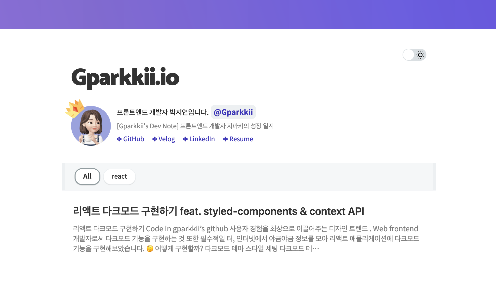

## 나만의 블로그를 만들어 보자 💪🏻

벨로그, 티스토리, 미디움 등 좋은 블로그 사이트 들이 많지만 서치를 하다보면 '개발자스럽게' 커스터마이징된 블로그들이 많이 보였다. 그래서 만들어본 [**나만의 블로그**](https://gparkkii.github.io) 👀

직접 커스터마이징해서 홈페이지를 만들 수도 있겠지만 시간도 많이 걸리고 좋은 템플릿들도 많기 때문에 눈여겨봤던 [**gatsby-starter-bee**](https://github.com/JaeYeopHan/gatsby-starter-bee) 로 블로그를 만들기로 결정했다.

### 📍 Todo List

1. 정적 사이트 생성기인 `Jekyll` 또는 `Gatsby`를 이용해서 블로그를 만든다.
2. `github pages` 또는 `netlify`로 호스팅을 한다.
3. `google search console`을 이용해서 검색엔진에 등록하기

---

## 1. Gatsby 및 템플릿 설치하기

> ### 💡 정적 사이트란?
>
> 정적 사이트 (Static Site)는 HTML, CSS, JavaScript로만 이뤄진 사이트다.
> 보통 동적인 사이트들은 사용자의 인터랙션에 따라 웹 페이지가 바뀌어가지만 **정적인 웹 페이지는 항상 같은 내용을 보여주기 때문에 구축이 쉽고 속도가 빠르다는 장점이 있다.**
> --> 기업 사이트 또는 개인 포폴 사이트에 많이 쓰인다.

### why Gatsby?

보통 정적사이트 생성기는 `Jekyll` 또는 `Gatsby`가 많이 쓰인다.

Jekyll은 `Ruby` 기반으로 만들어져 있고
Gatsby는 `React` 기반으로 만들어져 있다.

Ruby는 한번도 사용해본적이 없기에 익숙한 React 기반의 Gatsby를 선택했다.
--> Gatsby가 속도도 빠르고 React, GraphQL 기반으로 많은 사람들의 관심과 사랑을 받고 있다.

### clone gatsby-starter-bee

`gatsby-starter-bee`말고 다른 스타일의 템플릿을 원한다면 [**Gatsby Starters**](https://www.gatsbyjs.com/starters?) 페이지에서 서치하면 된다.

#### gatsby-starter-bee 설치

```javascript
npm install gatsby-cli
gatsby new my-blog-starter https://github.com/JaeYeopHan/gatsby-starter-bee
```

#### develop files

```javascript
cd my-blog-starter/
npm start
# open localhost:8000
```

---

## 2. Gatsby Blog Repository 생성

Github Pages로 배포하기 위해서는 `${my github id}.github.io` 라는 레포지토리를 생성한다.


레포지토리를 만들고 난 후 설치한 `my-blog-starter`에서 `git bash`를 실행시켜 해당 폴더의 git 정보를 초기화 해준다.

```javascript
rm -rf .git
git init
```

이후 아래 명령어로 내 `repository`에 `push`를 해준다.

```javascript
git add .
git commit -m "Init blog project"
git remote add origin https://github.com/${Github_ID}/${Git_Repository_Name}.git
git push -u origin master
```

여기까지 진행했다면 `${Github_ID}.github.io`로 접속했을 시 해당 레포지토리의 Readme.md 파일이 뜬다.

🚀 배포 성공!!

---

## 3. Gatsby Blog 커스텀하기

### package.json 설정

우선 package.json 파일로 들어가 괄호쳐놓은 name, description, url 등의 부분을 자신의 정보에 맞게 수정한다.

```javascript
// package.json
{
  "name": "gparkkii.io",
  "private": true,
  "description": "Gparkkii's Dev Note",
  "version": "0.1.0",
  "author": "Gparkkii[JiYeonPark]<jyp933@gmail.com>",
  "bugs": {
    "url": "https://github.com/gparkkii/gparkkii.github.io/issues"
  },

  ...

  "homepage": "https://gparkkii.github.io",
  "keywords": [
    "gatsby"
  ],
  "license": "MIT",
  "main": "n/a",
  "repository": {
    "type": "git",
    "url": "git+https://github.com/gparkkii/gparkkii.github.io.git"
  },
}
```

### gatsby.meta.config 설정

gatsby.meta.config 파일에 쓰여진 주석에 맞게 알맞은 정보를 등록한다.

```javascript
module.exports = {
  title: `Gparkkii.io`,
  description: `Blog posted about Gparkkii's Dev Note`,
  author: `Gparkkii`,
  introduction: `[Gparkkii's Dev Note] 프론트엔드 개발자 지파키의 성장 일지`,
  siteUrl: `https://gparkkii.github.io`, // Your blog site url
  social: {
    twitter: ``, // Your Twitter account
    github: ``, // Your GitHub account
    velog: ``, // Your Velog account
    facebook: ``, // Your Facebook account
    linkedin: ``, // Your LinkedIn account
    instagram: ``, // Your Instagram account
  },

  ...

  share: {
    facebookAppId: '', // v3.2
  },
  sponsor: {
    buyMeACoffeeId: '',
  },
  ga: '', // Add your google analytics tranking ID
}
```

### 수정된 버전 확인

`npm start` 로 localhost에서 수정된 부분을 확인해보세요.

--> `src` 내 `components`, `styles` 폴더 등을 둘러보며 자신의 스타일에 맞게 `custom` 할 수 있습니다.

---

## 4. Blog 포스팅 하는 방법

만들어 놓은 gatsby blog는 정적사이트이기에 `markdown`을 이용해서 포스팅 해야한다.

### (1) Readme.md 파일로 등록

`content`내에 있는 .md 파일들을 직접 수정하고 생성해서 포스팅하는 방법이다.


### (2) gatsby-post-gen 이용

[**gatsby-starter-bee Tutorial**](https://github.com/JaeYeopHan/gatsby-starter-bee) 에 나와있듯이 `gatsby-post-gen` 설치 후 `npm run post`를 이용해 아래 움짤처럼 포스트 등록을 할 수 있다.


#### gatsby-post-gen 설치

#### >> install

```javascript
npm install -D gatsby-post-gen
# yarn add -D gatsby-post-gen
```

#### >> package.json

```
"scripts": {
  "create": "gatsby-post-gen",
}
```

#### >> terminal

```
npm run create # Create blog post to `.md` file
```

**배포와 검색엔진 등록은 2탄에서 -->>**
