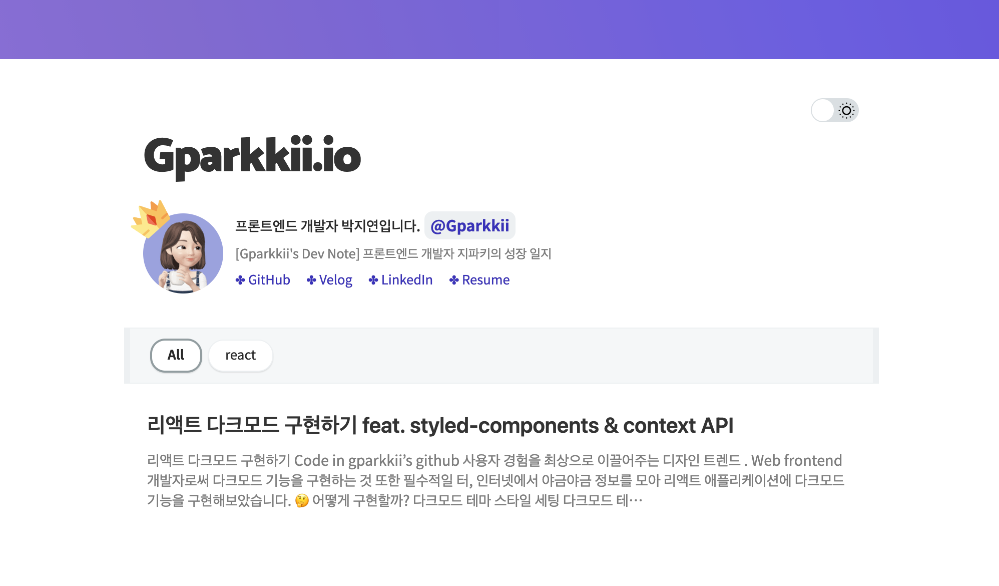

## 나만의 블로그를 만들어 보자 💪🏻

[**Gatsby로 나만의 블로그 만들기 feat. gatsby-starter-bee (1)**](https://gparkkii.github.io/gatsby/blog_starter/)

### 📍 Todo List

1. ~~정적 사이트 생성기인 `Jekyll` 또는 `Gatsby`를 이용해서 블로그를 만든다.~~
2. `github pages` 또는 `netlify`로 호스팅을 한다.
3. `google search console`을 이용해서 검색엔진에 등록하기

---

## 5. Gatsby Blog 호스팅하기

`gatsby-starter-bee`의 커스텀 및 포스팅이 완료됐다면 호스팅을 해보자.
`netlify`로 간단히 호스팅하는 방법도 있지만 `github pages`로 호스팅하기로 결정!

### Github Pages로 Deploy

이미 레포지토리를 만들면서 도메인은 생성이 됐기 때문에 작업한 결과물을 build 시켜주면 된다.

#### ✤ package.json에 deploy script 추가

`package.json`에 아래 코드를 추가한다.

```javascript
"scripts": {
    "deploy": "gatsby build && gh-pages -d public -b master -r 'git@github.com:${your github id}/${github page name}.github.io.git'"
}
```

#### ✤ gh-pages 설치

만약 `gh-pages`라는 브랜치 없이 (브랜치 네이밍은 자유롭게 가능) deploy를 하면


**다음과 같이 변해버린 파일들에 멘붕이 올 수 있다..**

따로 브랜치를 파서 기존 코드들을 저장해주자.

```javascript
npm i --save-dev gh-pages
```

#### ✤ deploy!!!

`gh-pages` 패키지 설치가 끝나면 deploy를 해주자!

```javascript
$ npm run deploy
```

---

## 6. Github Actions로 배포 자동화하기

이제 배포가 됐기에 자신의 깃허브 블로그 주소에 들어가면 배포된 나만의 블로그를 만나볼 수 있다. 😀

이제 `gh-pages` 브랜치에서 `Posting` 해주고
`master` 브랜치에는 `merge`만 시켜주면 된다.

하지만! 복잡한 `merge` 과정을 거칠 필요 없이 **Github Actions** 라는걸 이용하면 정말 간단하게 배포를 자동화 할 수 있다.


### ✅ Github Actions Token 생성

Github Actions를 사용하기 위해서는 해당 레포지토리에 접근할 수 있는 `Token`을 먼저 생성해줘야한다.

[**🔗 토큰 생성 링크**](https://github.com/settings/tokens)

해당 링크로 들어가서 **Generate New Token** 버튼을 클릭!


토큰 이름 작성후 아래 **Select Scopes** 부분을 다 선택해준다.

이후 create 버튼을 눌러주면 사용해야될 `token key`가 생성된다.


### Repository에 Token 할당하기

이제 내 블로그 레포지토리의 `Setting` 에서 `Secret` 메뉴를 클릭합니다.


**New Repository Secret**을 누른 후 본문 입력칸에 복사한 **Token Key** 를 붙여넣기하면 끝!


### New workflow 생성

Github Actions의 초기화면은 다음과 같다.
**Set up a workflow yourself** 를 눌러준다.


### main.yml 생성

**Set up a workflow yourself** 를 누르면 다음과 같이 자동으로 `main.yml`이 생성된다.


해당 내용을

```javascript
on:
  push:
    branches:
      - gh-pages
name: build gatsby
jobs:
  build_gatsby:
    name: build
    runs-on: ubuntu-latest
    steps:
      - uses: actions/checkout@v1

      - name: yarn install
        run: yarn install

      - name: gatsby build
        env:
          GH_API_KEY: ${{ secrets.GITHUB }}
        run: yarn build

      - name: deploy
        uses: maxheld83/ghpages@v0.2.1
        env:
          GITHUB_TOKEN: ${{ secrets.GITHUB_TOKEN }}
          GH_PAT: ${{ secrets.GITHUB }}
          BUILD_DIR: 'public/'
```

다음과 같이 바꿔주면 끝!

이후 `gh-pages`에서 `commit`을 하면 **Github Actions** 페이지에서
다음과 같이 커밋되어지는 상황을 확인할 수 있다.


---

## 2. Google Search Console 등록하기

#### 💡 Google Search Console 이란?

검색엔진에 내 블로그를 노출시켜 더 많은 방문자가 유입되도록 도와준다.
자세한 등록 방법은 [**🔗 무리무리님의 블로그**](https://sasumpi123.github.io/general/gitblog4/)를 참고하여 등록해보자.

---

이렇게 완성된 [**🔗 나만의 블로그**](https://gparkkii.github.io)
TIL 이나 회고록을 작성하며 Github 잔디관리까지 할 수 있는 퍼펙트한 블로그가 완성됐다!

나만의 블로그를 만들어 본 만큼 더 부지런하게 개발 공부를 해봐야겠다😎

---

> 참조
> https://sasumpi123.github.io/general/gitblog3/
